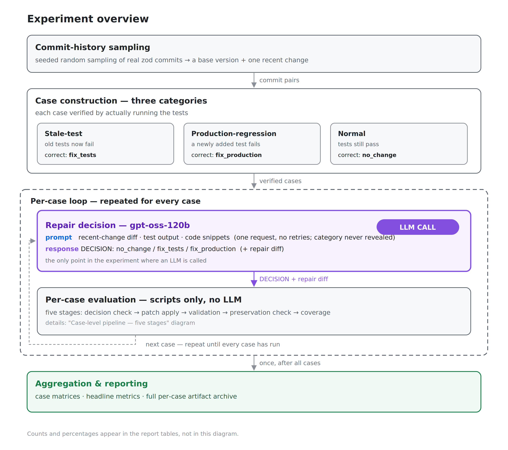
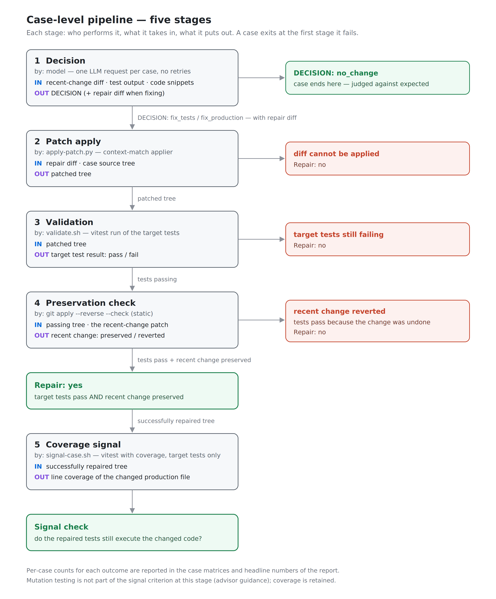

# Evaluating LLM-Based Test Maintenance on Real Commit History: Decision Correctness, Repair Success, and Test Coverage

- Subject project: [colinhacks/zod](https://github.com/colinhacks/zod) / Model: `openai/gpt-oss-120b`
- Artifacts (per-case packets, prompts, model responses, logs, coverage results): [experiment/2026-07-week4](https://github.com/Hamjoon/zod/tree/experiment/2026-07-week4) — the branch this report lives on

## Experiment question

When a code repository has just been changed and some tests now fail (or still pass),
the correct maintenance action depends on *why*: sometimes the tests are outdated,
sometimes the change introduced a bug, and sometimes nothing needs fixing at all.
This experiment asks whether a language model can tell these situations apart and act
correctly, given only the recent change and the current test results.

For 30 cases (10 per category) sampled from the commit history of the zod repository,
the model must:

1. Choose the correct response: `no_change` / `fix_tests` / `fix_production`.
2. Produce a successful repair — the target tests pass **and** the recent change is
   still present in the repaired code.
3. Keep the repaired tests covering the changed production code (coverage check).

## Case composition

Each case is built from a real pair of commits in the zod history: a base version of
the repository, plus one recent change applied on top of it. The three categories
differ in what that recent change is and what the correct response is:

- **Stale-test cases** (10): the production behavior was changed intentionally, so
  tests written for the old behavior now fail. The tests are outdated, not the code —
  the correct response is `fix_tests`.
- **Production-regression cases** (10): a newly added test reveals a bug in the
  production code, so the test fails. The test is right and the code is wrong — the
  correct response is `fix_production`.
- **Normal cases** (10): the test suite still passes after the production change.
  Nothing is broken — the correct response is `no_change`.

Case IDs below are prefixed `s`, `p`, and `n` for the three categories respectively.

Cases were drawn by seeded random sampling from a candidate pool of zod commits
(2025-01 onward) filtered by pre-registered exclusion criteria. Each candidate's
failing/passing condition was verified by actually running the tests, and the first 10
verified candidates per category were adopted
(selection record: [zod-30case-verification-results.md](zod-30case-verification-results.md);
screening record: [zod-30case-screening.md](zod-30case-screening.md)).

## Protocol overview

Every case runs under the same framing: with no category hint, the model receives the
recent-change diff, the test run output, and code snippets around the change, then
decides whether a modification is needed and, only if so, produces a repair diff. Each
case is a single request to the model — no retries, no follow-up turns — with
deterministic settings (temperature 0).

The prompt separates a **fixed template** from **per-case variables**. The template —
identical across all 30 cases — consists of the intro, the constraint list (response
protocol, no weakening or deleting of test assertions, preserve nearby behavior that
should still pass) and the required response format (a `DECISION` first line, then a
unified diff only if a fix is chosen). The variables are the case's allowed-file list
and three tagged inputs: the recent-change diff, the test run output, and code
snippets taken ±25 lines around the changed regions. Every prompt sent is archived
per case.

Each case then passes through five pipeline stages:

**Repair is judged as a single binary outcome:** *yes* means the target tests pass
**and** the recent change is still present in the repaired code; *no* means anything
else (the model's diff could not be applied, tests still fail, or the tests only pass
because the repair undid the recent change). The signal check measures test coverage
of the changed production file on successfully repaired code.

## Results

### Case Matrix — stale-test cases (expected DECISION: fix_tests)

| ID | Base | Recent change | DECISION | Repair |
| --- | --- | --- | --- | --- |
| [s01](../experiments/test-maintenance/cases/s01-0cf45896/) | [a410616b](https://github.com/colinhacks/zod/commit/a410616b) | [0cf45896](https://github.com/colinhacks/zod/commit/0cf45896) tuple→JSON Schema oneOf | fix_tests ✅ | **yes** |
| [s02](../experiments/test-maintenance/cases/s02-66bda749/) | [9443aab0](https://github.com/colinhacks/zod/commit/9443aab0) | [66bda749](https://github.com/colinhacks/zod/commit/66bda749) ZodMiniType `.refine()` removal | fix_production ❌ | no |
| [s03](../experiments/test-maintenance/cases/s03-3a8edd74/) | [103f69be](https://github.com/colinhacks/zod/commit/103f69be) | [3a8edd74](https://github.com/colinhacks/zod/commit/3a8edd74) preprocess output type revert | fix_production ❌ | no |
| [s04](../experiments/test-maintenance/cases/s04-6b13cc94/) | [39d84d03](https://github.com/colinhacks/zod/commit/39d84d03) | [6b13cc94](https://github.com/colinhacks/zod/commit/6b13cc94) JSON Schema pattern polish | fix_production ❌ | no |
| [s05](../experiments/test-maintenance/cases/s05-27f13d62/) | [845a230b](https://github.com/colinhacks/zod/commit/845a230b) | [27f13d62](https://github.com/colinhacks/zod/commit/27f13d62) regex precision improvement | fix_tests ✅ | no |
| [s06](../experiments/test-maintenance/cases/s06-6d47791b/) | [a2c98924](https://github.com/colinhacks/zod/commit/a2c98924) | [6d47791b](https://github.com/colinhacks/zod/commit/6d47791b) v.custom input type fix | fix_production ❌ | no |
| [s07](../experiments/test-maintenance/cases/s07-2529f827/) | [98c849de](https://github.com/colinhacks/zod/commit/98c849de) | [2529f827](https://github.com/colinhacks/zod/commit/2529f827) JSON Schema identifier correction | fix_tests ✅ | no |
| [s08](../experiments/test-maintenance/cases/s08-ad2fc5ee/) | [f97733ff](https://github.com/colinhacks/zod/commit/f97733ff) | [ad2fc5ee](https://github.com/colinhacks/zod/commit/ad2fc5ee) File schema JSON Schema | fix_production ❌ | no |
| [s09](../experiments/test-maintenance/cases/s09-f98d1a30/) | [592de8de](https://github.com/colinhacks/zod/commit/592de8de) | [f98d1a30](https://github.com/colinhacks/zod/commit/f98d1a30) URL behavior standardization | fix_tests ✅ | no |
| [s10](../experiments/test-maintenance/cases/s10-5fdece94/) | [a73a3b30](https://github.com/colinhacks/zod/commit/a73a3b30) | [5fdece94](https://github.com/colinhacks/zod/commit/5fdece94) min/maxLength inclusive | fix_tests ✅ | no |

### Case Matrix — production-regression cases (expected DECISION: fix_production)

| ID | Base | Recent change | DECISION | Repair |
| --- | --- | --- | --- | --- |
| [p01](../experiments/test-maintenance/cases/p01-7f789def/) | [2e5b23dc](https://github.com/colinhacks/zod/commit/2e5b23dc) | [7f789def](https://github.com/colinhacks/zod/commit/7f789def) record non-enumerable property skip | fix_production ✅ | **yes** |
| [p02](../experiments/test-maintenance/cases/p02-f75d8529/) | [17e7f3b4](https://github.com/colinhacks/zod/commit/17e7f3b4) | [f75d8529](https://github.com/colinhacks/zod/commit/f75d8529) `z.literal` decimal-point escape | fix_production ✅ | **yes** |
| [p03](../experiments/test-maintenance/cases/p03-002e01ad/) | [f97e80da](https://github.com/colinhacks/zod/commit/f97e80da) | [002e01ad](https://github.com/colinhacks/zod/commit/002e01ad) isPlainObject constructor handling | fix_production ✅ | **yes** |
| [p04](../experiments/test-maintenance/cases/p04-3048d14b/) | [34b400a5](https://github.com/colinhacks/zod/commit/34b400a5) | [3048d14b](https://github.com/colinhacks/zod/commit/3048d14b) extend fix (#4961) | fix_production ✅ | **yes** |
| [p05](../experiments/test-maintenance/cases/p05-363c966b/) | [8506c352](https://github.com/colinhacks/zod/commit/8506c352) | [363c966b](https://github.com/colinhacks/zod/commit/363c966b) standard-schema toJSONSchema (#5560) | fix_production ✅ | no |
| [p06](../experiments/test-maintenance/cases/p06-3cd45ebc/) | [3a818de1](https://github.com/colinhacks/zod/commit/3a818de1) | [3cd45ebc](https://github.com/colinhacks/zod/commit/3cd45ebc) httpUrl() strict validation | fix_production ✅ | no |
| [p07](../experiments/test-maintenance/cases/p07-584b1089/) | [15cafa13](https://github.com/colinhacks/zod/commit/15cafa13) | [584b1089](https://github.com/colinhacks/zod/commit/584b1089) base64 whitespace rejection | fix_production ✅ | **yes** |
| [p08](../experiments/test-maintenance/cases/p08-2be1c6ad/) | [8ab23742](https://github.com/colinhacks/zod/commit/8ab23742) | [2be1c6ad](https://github.com/colinhacks/zod/commit/2be1c6ad) generic assignability | fix_production ✅ | no |
| [p09](../experiments/test-maintenance/cases/p09-25a4c376/) | [e45e61b6](https://github.com/colinhacks/zod/commit/e45e61b6) | [25a4c376](https://github.com/colinhacks/zod/commit/25a4c376) openapi-3.0 record/tuple output | fix_production ✅ | **yes** |
| [p10](../experiments/test-maintenance/cases/p10-2e5b23dc/) | [518f15dd](https://github.com/colinhacks/zod/commit/518f15dd) | [2e5b23dc](https://github.com/colinhacks/zod/commit/2e5b23dc) invalid discriminator options | fix_production ✅ | no |

### Case Matrix — normal cases (expected DECISION: no_change)

| ID | Base | Recent change | DECISION | Unnecessary edit |
| --- | --- | --- | --- | --- |
| [n01](../experiments/test-maintenance/cases/n01-0d87aa4a/) | [ed933d91](https://github.com/colinhacks/zod/commit/ed933d91) | [0d87aa4a](https://github.com/colinhacks/zod/commit/0d87aa4a) Make id lazy | no_change ✅ | none |
| [n02](../experiments/test-maintenance/cases/n02-592de8de/) | [5e4ff20b](https://github.com/colinhacks/zod/commit/5e4ff20b) | [592de8de](https://github.com/colinhacks/zod/commit/592de8de) Rollup comment warning | no_change ✅ | none |
| [n03](../experiments/test-maintenance/cases/n03-5b574501/) | [65f1f404](https://github.com/colinhacks/zod/commit/65f1f404) | [5b574501](https://github.com/colinhacks/zod/commit/5b574501) refine abort+when | no_change ✅ | none |
| [n04](../experiments/test-maintenance/cases/n04-5905a8d8/) | [b2592111](https://github.com/colinhacks/zod/commit/b2592111) | [5905a8d8](https://github.com/colinhacks/zod/commit/5905a8d8) check-versions script | no_change ✅ | none |
| [n05](../experiments/test-maintenance/cases/n05-9712a670/) | [73b071d7](https://github.com/colinhacks/zod/commit/73b071d7) | [9712a670](https://github.com/colinhacks/zod/commit/9712a670) ~standard lazy init | no_change ✅ | none |
| [n06](../experiments/test-maintenance/cases/n06-4975f3a0/) | [d589186c](https://github.com/colinhacks/zod/commit/d589186c) | [4975f3a0](https://github.com/colinhacks/zod/commit/4975f3a0) discriminator generic | no_change ✅ | none |
| [n07](../experiments/test-maintenance/cases/n07-36c4ee35/) | [aab33566](https://github.com/colinhacks/zod/commit/aab33566) | [36c4ee35](https://github.com/colinhacks/zod/commit/36c4ee35) weakmap restoration | no_change ✅ | none |
| [n08](../experiments/test-maintenance/cases/n08-195e8696/) | [285bde7f](https://github.com/colinhacks/zod/commit/285bde7f) | [195e8696](https://github.com/colinhacks/zod/commit/195e8696) `@__PURE__` annotation | no_change ✅ | none |
| [n09](../experiments/test-maintenance/cases/n09-c5d9e7ce/) | [edc34778](https://github.com/colinhacks/zod/commit/edc34778) | [c5d9e7ce](https://github.com/colinhacks/zod/commit/c5d9e7ce) JWT alg arbitrary string | no_change ✅ | none |
| [n10](../experiments/test-maintenance/cases/n10-b142ea8f/) | [f350a693](https://github.com/colinhacks/zod/commit/f350a693) | [b142ea8f](https://github.com/colinhacks/zod/commit/b142ea8f) Fix $strip | no_change ✅ | none |

### Headline numbers

- DECISION agreement: **25 / 30** (stale-test 5/10, production-regression 10/10, normal 10/10)
- Repair success: **7 / 20** of the cases that required a fix (stale-test 1/10, production-regression 6/10)
- Coverage (7 successful repairs): **7 / 7** — the repaired target tests execute the
  changed production file in every successful repair
- Unnecessary edits on normal cases: **0 / 10**

## Observations

- **Asymmetry between the two failing-test categories, and one-directional errors.**
  Production-regression cases chose `fix_production` 10/10, but stale-test cases chose
  the correct `fix_tests` only 5/10 — and all five misclassifications were
  `fix_production`, i.e., undoing the intended production change. The opposite errors
  (choosing `fix_tests` on a production-regression case, or editing anything on a
  normal case) never occurred. Errors flow in one direction only: the model trusts
  the tests as the specification and doubts the recent production change.
- **Repairs that pass by undoing the change, and how they are caught.** Three of the
  five misclassified stale-test cases actually made the target tests pass — by
  reverting the intended change. Test results alone cannot distinguish these from
  correct repairs. A single mechanical check — verifying that the recent change is
  still present in the repaired code — identified exactly these three across all 30
  cases with no false positives. A definition of repair success based only on passing
  tests would count these reverts as successes, which is why the binary judgment
  requires both passing tests **and** a preserved recent change.

## Limitations

- The prompt structure would allow the expected classification to be recovered from
  two surface cues alone — whether the recent diff touches a test file or a production
  file, and whether the tests currently fail — so DECISION agreement is an auxiliary
  metric. Counter-observation: had the model simply followed those surface cues,
  classification would have been 30/30; the measured 5/10 on stale-test cases shows
  it did not.
- Coverage confirms the changed production file is executed by the repaired tests,
  but does not by itself measure how well those tests would detect future bugs.
- Single model, single repository (zod).

---

Execution details and per-case records: [zod-v2-30case-report-full.md](./zod-v2-30case-report-full.md)
