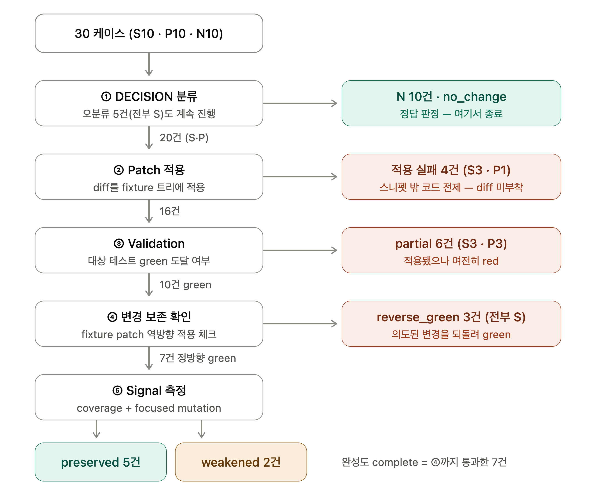
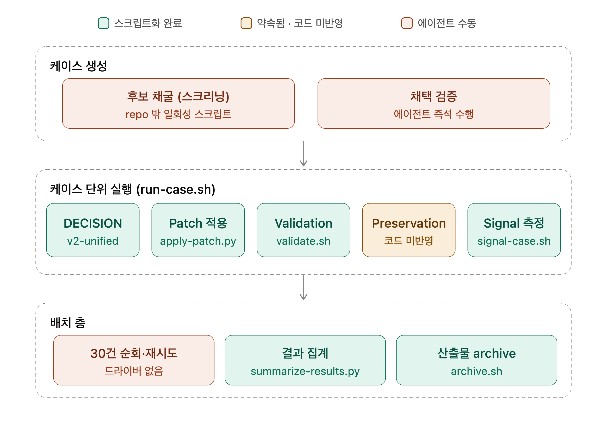

## 지난주(7월1주차)와 이번주 실험 비교

| 항목 | 1주차 (v1) | 3주차 (v2)                                               |
| --- | --- | ------------------------------------------------------ |
| 실행 모드 | 카테고리별 상이 (S는 test 수정 강제) | 전 케이스 동일, 3지선다 자유 선택                                   |
| 케이스 | 6개 (S3+P3), 수동 선정 | 30개 (S/P/N 각 10), seed 기록 무작위 표집 + 실행 검증               |
| 파이프라인 | 분류 → validation → signal | 분류 → **patch 적용** → validation → **변경 보존 확인** → signal |
| 분류 결과 | 6/6 (단, S는 강제된 control) | 25/30 (S 5/10, P 10/10, N 10/10)                       |
| 새 발견 | — | reverse_green 3건, preservation 체크의 필요성                 |

## Case Matrix의 판정 5단계

## 자동화 파이프 라인 (설계 및 진행 상황)

####  케이스 생성 단계
수동 (사람 또는 AI 에이전트 수행)

#### 케이스 단위 실행 단계
5단계 중 4개가 자동화(스크립트화) 완료

#### 배치 단계
집계와 archive까지 스크립트화 완료
